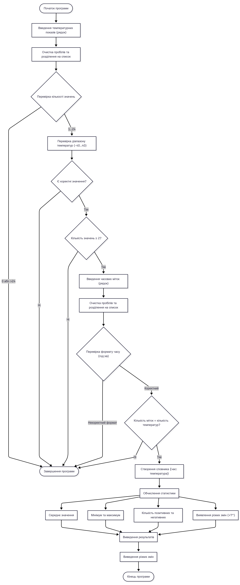

# Міністерство освіти і науки України Національнийй технічний університет 
# "Харківський політехнічний інститут" Кафедра Автоматики та управління в технічних системах
## *Лабораторна робота з дисципліни: "Прикладне програмування на Python"*


Виконав: 
студент групи ІКМ-722а 
**Шалімов Олександр**

**Керівник:**  
**д.т.н. Караман Д.Г.**


**Харків – 2025**

---

### Мета роботи : Створення програми, яка виконує приймання даних, введених користувачем, виконує їх обробку та виводить результат відповідно до індивідуального завдання. В залежності від завдання приймається рішення використовувати ти чи інші можливості мови Python.

Лабораторна робота охоплює навчальний матеріал з 5 тем першого модулю, а саме:

зальні принципи написання та виконання програм на мові Python, створення простих програм у форматі скриптів
основні типи даних: скалярні (числові та рядкові) та колекційні (списки, кортежі, множини, словники), оператори
конструкції управління потоком виконання команд: умовні розгалуження та цикли

# Програма для аналізу температурних показів за день
``` python
print("=== Аналіз температурних показів за день ===")
print("Введіть до 24 значень температур (через пробіл):")
```

# Введення температур користувачем
``` python
temperatures_string = input("Введіть через пробіл температуру за день: ")
temperatures = temperatures_string.split()
```

# Перевірка кількості значень
``` python
if len(temperatures) == 0 or len(temperatures) > 24:
    print("Помилка: введіть від 1 до 24 значень температури.")
    exit()
else:
    for t in temperatures:
        value = float(t)
        if value > -40 and value < 40:
            norms = False
        else:
            print("Температурні покази не в межах норми.")
```

# Перевірка, чи додались у список хоч якісь дані (список с числовими показами містить значення), інакше завершити програму
``` python
if len(temperatures) == 0:
    print("Помилка: не введено жодного значення температури.")
    exit()
```

# Введення часових міток
# Створення та наповнення списку для числових значень показів температур
``` python
hours_string = input("Введіть  часові мітки для кожного показу (у форматі 'година:хвилина') через пробіл: ")
hours = hours_string.split()
temp_dict = {}
```

# Перевірка кількості міток
``` python
if len(hours) != len(temperatures):
    print("Кількість температур не співпадає з кількістю годин!")
    exit()
```

# Перевірка формату часу
``` python
for h in hours:
    hour = h.split(":")
    if float(hour[0]) > 23 or float(hour[0]) < 0 or float(hour[1]) > 59 or float(hour[1]) < 0:
        print("Помилка: неправильний формат часової мітки.")
        exit()
```

# Створення словника {час: температура, час: температура, ...}
``` python
for i in range(len(temperatures)):
    float_temp = float(temperatures[i])
    temperatures[i] = float_temp

temp_dict = dict(zip(hours, temperatures))
```

# === Обчислення характеристик через словник з даними ===
### TODO: зробити розрахунок статистичних параметрів (середнє значення, мінімум, максимум, кількість позитивних та негативних температур, різкі зміни) по даним зі словника
### б) розрахувати середнє значення
``` python
print(f"Середнє значення температури: {sum(temp_dict.values())/len(temp_dict)}°C")
```
### в) розрахувати мінімум та максимум
``` python
min_temp = min(temp_dict.values())
max_temp = max(temp_dict.values())
```
### г) розрахувати кількість позитивних та негативних температур
``` python
sum_positives = 0
sum_negatives = 0
for temp in temp_dict.values():
    if float(temp) >= 0:
        sum_positives += 1
    else:
        sum_negatives += 1
```
### д) зробити виявлення різких змін: зробити список, в якому зберігати кортеж-діапазон часових міток, між якими стався різкий перепад температур (>7 градусів), та різниця температур (час1, час2, різниця)
``` python
different_hours = []
for t in range(len(temperatures)-1):
    if(abs(float(temperatures[t])-float(temperatures[t+1]))>7):
        time_diff = (hours[t], hours[t+1], abs(float(temperatures[t])-float(temperatures[t+1])))
        different_hours.append(time_diff)
```
# === Виведення результатів ===
``` python
print("\n=== РЕЗУЛЬТАТ АНАЛІЗУ ===")
print("Температурні дані (час → температура):")
for hour, temp in temp_dict.items():
    print(f"{hour} -> {temp}°C")
```
### TODO: вивести отримані числові значення статистичних показників
``` python
print(f"Статистичні показники:")
print(f"Середнє значення температури: {sum(temp_dict.values())/len(temp_dict)}°C")
print(f"Мінімальна температура: {min_temp}°C")
print(f"Максимальна температура: {max_temp}°C")
print(f"Кількість позитивних температур: {sum_positives}")
print(f"Кількість негативних температур: {sum_negatives}")
```
# Виведення різких змін
### TODO: за утвореним списком з кортежів (час1, час2, різниця) вивести повідомлення про різкі зміни
``` python
if different_hours:
    print("Різкі зміни температури відбулися між наступними часовими мітками:")
    for time_pair in different_hours:
        print(f"{time_pair[0]} та {time_pair[1]} – різниця: {time_pair[2]}°C")

print("\n=== Кінець аналізу ===")
```
### Блок схема коду 



### Повний код програми розміщено на віддаленому репозиторію
[Посилання на github репозиторій](https://example.com)
